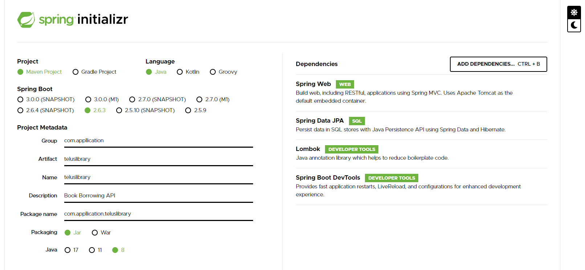

# BookBorrowing

## Relational Diagram
[Read Only](https://tinyurl.com/mu77fhk4)

## Class Diagram
[Read Only](https://tinyurl.com/3r9xf4ja)

## Trello Board
https://trello.com/b/avKyN8mS/bookborrowing

## Spring Initializr

## Run Spring Boot Application in VSCode

-  Goto Pom and run mvn clean install
-  ./mvnw spring-boot:run

## Enter to H2 Console

- http://localhost:8080/h2-console
- Driver Class: org.h2.Driver
- JDBC URL: jdbc:h2:mem:testdb
- Username: sa
- Password: